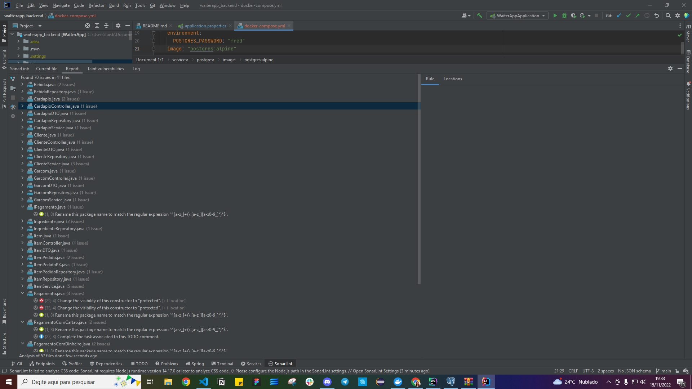

# waiterapp
Criação de uma API de agendamento de pedidos para um restaurante.

## Trabalho desenvolvido na matéria TCC00340 - Desenvolvimento de Aplicações Corporativas - 2022/1
Documentação: https://trabalho-dev-corp.herokuapp.com/swagger-ui.html


## How to run tests

### End to end tests
The end to end test for this project was done by using cypress, to execute the test suit run the following commando on your terminal.
```
make run-integration-tests # docker-compose -f integration/docker-compose-integration-tests.yml run e2e
```


### Locust load tests
The load tests for this project are present inside the `locust` folder, to execute them you must have `docker` and `docker-compose` installed on your local machine.

```
make run-load-tests # docker-compose -f ./locust/docker-compose-load-tests.yml up
```

The command above should open the locust web interface on the following url: http://localhost:8089


### Sonarlint pictures
Sonarlint analysis before correcting:


Sonarlint analysis after correcting:
